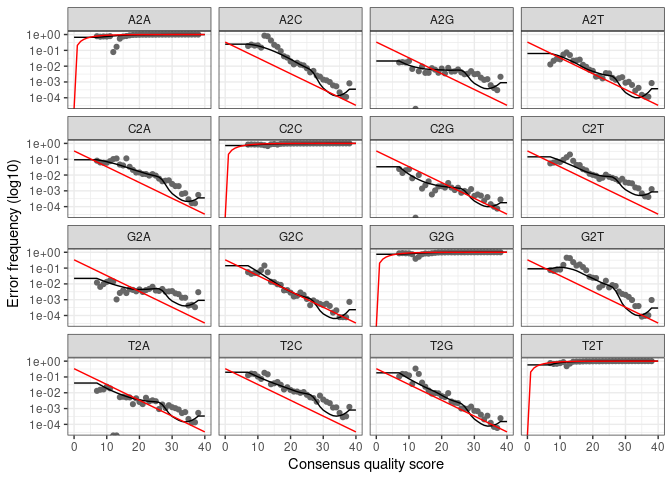

Jachymov19_amplicon
================
Michal Strejcek @ UCT Prague
Sep-01-2020

## 16S amplicon analysis of Jachymov hotsprings samples

Prepare files for dada2.

``` r
library(dada2); packageVersion("dada2")
```

    ## Loading required package: Rcpp

    ## [1] '1.18.0'

``` r
library(phyloseq)
library(dplyr)
```

    ## 
    ## Attaching package: 'dplyr'

    ## The following objects are masked from 'package:stats':
    ## 
    ##     filter, lag

    ## The following objects are masked from 'package:base':
    ## 
    ##     intersect, setdiff, setequal, union

``` r
library(ggplot2)
devtools::source_url("https://raw.githubusercontent.com/strejcem/cleanSeqTools/master/R/cleanSeqTools.R")
```

    ## ℹ SHA-1 hash of file is f4456b57e53bc6f7d9a3ef69c107311fce9aaa3a

    ## cleanSeqTools.R v1.31 loaded (Mar-29-2021)

    ## By Michal Strejcek @ UCT Prague

    ## Depencencies: 'dada2', 'ShortRead', 'phyloseq'

The directory ‘source’ contains the fastq files.

``` r
checkPrimers("source", fPrimer = "GTGYCAGCMGCNGCGG", rPrimer = "CCGYCAATTYMTTTRAGTTT")
```

    ## Randomly choosen: GN_Beh_1_R1.fastq.gz

    ## Checking forward primer.

    ##    position   hits
    ## 1         1 131412
    ## 2         2     66
    ## 3         3      0
    ## 4         4      0
    ## 5         5      0
    ## 6         6      0
    ## 7         7      0
    ## 8         8      0
    ## 9         9      0
    ## 10       10      0

    ## No spacer detected!

    ## 97.3% matched!

    ## 

    ## Randomly choosen: GN_Beh_1_R2.fastq.gz

    ## Checking reverse primer.

    ##    position   hits
    ## 1         1 129755
    ## 2         2     40
    ## 3         3      0
    ## 4         4      0
    ## 5         5      0
    ## 6         6      0
    ## 7         7      0
    ## 8         8      0
    ## 9         9      0
    ## 10       10      0

    ## No spacer detected!

    ## 96% matched!

    ## 

``` r
removePrimers(dir.from = "source", dir.to = "removedPrimer",
                              fPrimer = "GTGYCAGCMGCNGCGG", rPrimer = "CCGYCAATTYMTTTRAGTTT",
                              )
```

    ## Discarded 2.1% reads in GN_Agr_1_R1.fastq.gz and 4% reads in GN_Agr_1_R2.fastq.gz.

    ## Discarded 2.9% reads in GN_Agr_2_R1.fastq.gz and 4.5% reads in GN_Agr_2_R2.fastq.gz.

    ## Discarded 2.7% reads in GN_Beh_1_R1.fastq.gz and 3.9% reads in GN_Beh_1_R2.fastq.gz.

    ## Discarded 2.2% reads in GN_Beh_2_R1.fastq.gz and 4.4% reads in GN_Beh_2_R2.fastq.gz.

    ## Discarded 2.2% reads in GN_C1_1_R1.fastq.gz and 3.6% reads in GN_C1_1_R2.fastq.gz.

    ## Discarded 2.2% reads in GN_C1_2_R1.fastq.gz and 4% reads in GN_C1_2_R2.fastq.gz.

    ## Discarded 2.1% reads in GN_Cur_1_R1.fastq.gz and 3.7% reads in GN_Cur_1_R2.fastq.gz.

    ## Discarded 2.2% reads in GN_Cur_2_R1.fastq.gz and 4.2% reads in GN_Cur_2_R2.fastq.gz.

    ## Discarded 2.5% reads in GN_KAC1_1_R1.fastq.gz and 3% reads in GN_KAC1_1_R2.fastq.gz.

    ## Discarded 2.4% reads in GN_KAC1_2_R1.fastq.gz and 2.8% reads in GN_KAC1_2_R2.fastq.gz.

    ## Discarded 2.3% reads in GN_Kbeh_1_R1.fastq.gz and 3% reads in GN_Kbeh_1_R2.fastq.gz.

    ## Discarded 2.9% reads in GN_Kbeh_2_R1.fastq.gz and 2.4% reads in GN_Kbeh_2_R2.fastq.gz.

    ## Discarded 1.7% reads in GN_Kcur_1_R1.fastq.gz and 3.2% reads in GN_Kcur_1_R2.fastq.gz.

    ## Discarded 2.2% reads in GN_Kcur_2_R1.fastq.gz and 2.9% reads in GN_Kcur_2_R2.fastq.gz.

    ## Discarded 2% reads in GN_Mock_1_R1.fastq.gz and 3.4% reads in GN_Mock_1_R2.fastq.gz.

    ## Discarded 2.1% reads in GN_Mock_2_R1.fastq.gz and 2.6% reads in GN_Mock_2_R2.fastq.gz.

    ## [[1]]
    ## [1] 46522
    ## 
    ## [[2]]
    ## [1] 44986
    ## 
    ## [[3]]
    ## [1] 126291
    ## 
    ## [[4]]
    ## [1] 123755
    ## 
    ## [[5]]
    ## [1] 59065
    ## 
    ## [[6]]
    ## [1] 54294
    ## 
    ## [[7]]
    ## [1] 120960
    ## 
    ## [[8]]
    ## [1] 111981
    ## 
    ## [[9]]
    ## [1] 4764
    ## 
    ## [[10]]
    ## [1] 4456
    ## 
    ## [[11]]
    ## [1] 6234
    ## 
    ## [[12]]
    ## [1] 4791
    ## 
    ## [[13]]
    ## [1] 5458
    ## 
    ## [[14]]
    ## [1] 6119
    ## 
    ## [[15]]
    ## [1] 92553
    ## 
    ## [[16]]
    ## [1] 89010

based on DADA2 Pipeline Tutorial (1.16)

``` r
path <- "removedPrimer"
list.files(path)
```

    ##  [1] "GN_Agr_1_R1.fastq.gz"  "GN_Agr_1_R2.fastq.gz"  "GN_Agr_2_R1.fastq.gz" 
    ##  [4] "GN_Agr_2_R2.fastq.gz"  "GN_Beh_1_R1.fastq.gz"  "GN_Beh_1_R2.fastq.gz" 
    ##  [7] "GN_Beh_2_R1.fastq.gz"  "GN_Beh_2_R2.fastq.gz"  "GN_C1_1_R1.fastq.gz"  
    ## [10] "GN_C1_1_R2.fastq.gz"   "GN_C1_2_R1.fastq.gz"   "GN_C1_2_R2.fastq.gz"  
    ## [13] "GN_Cur_1_R1.fastq.gz"  "GN_Cur_1_R2.fastq.gz"  "GN_Cur_2_R1.fastq.gz" 
    ## [16] "GN_Cur_2_R2.fastq.gz"  "GN_KAC1_1_R1.fastq.gz" "GN_KAC1_1_R2.fastq.gz"
    ## [19] "GN_KAC1_2_R1.fastq.gz" "GN_KAC1_2_R2.fastq.gz" "GN_Kbeh_1_R1.fastq.gz"
    ## [22] "GN_Kbeh_1_R2.fastq.gz" "GN_Kbeh_2_R1.fastq.gz" "GN_Kbeh_2_R2.fastq.gz"
    ## [25] "GN_Kcur_1_R1.fastq.gz" "GN_Kcur_1_R2.fastq.gz" "GN_Kcur_2_R1.fastq.gz"
    ## [28] "GN_Kcur_2_R2.fastq.gz" "GN_Mock_1_R1.fastq.gz" "GN_Mock_1_R2.fastq.gz"
    ## [31] "GN_Mock_2_R1.fastq.gz" "GN_Mock_2_R2.fastq.gz"

``` r
fnFs <- sort(list.files(path, pattern="_R1.fastq.gz", full.names = TRUE))
fnRs <- sort(list.files(path, pattern="_R2.fastq.gz", full.names = TRUE))
# Extract sample names
sample.names <-strsplit(basename(fnFs), "_")
sample.names <- sapply(sample.names, function(x) paste(x[2:3], collapse = "_"))

plotQualityProfile(fnFs[14:15]) + ggplot2::xlim(200,300) + ggplot2::ylim(20,40)
```

    ## Warning: `guides(<scale> = FALSE)` is deprecated. Please use `guides(<scale> =
    ## "none")` instead.

    ## Scale for 'y' is already present. Adding another scale for 'y', which will
    ## replace the existing scale.

    ## Warning: Removed 10548 rows containing missing values (geom_tile).

    ## Warning: Removed 199 row(s) containing missing values (geom_path).

    ## Warning: Removed 199 row(s) containing missing values (geom_path).

    ## Warning: Removed 199 row(s) containing missing values (geom_path).

    ## Warning: Removed 199 row(s) containing missing values (geom_path).

    ## Warning: Removed 2 rows containing missing values (geom_text).

    ## Warning: Removed 555 row(s) containing missing values (geom_path).

<!-- -->

``` r
plotQualityProfile(fnRs[10:11]) + ggplot2::xlim(150,250)                    
```

    ## Warning: `guides(<scale> = FALSE)` is deprecated. Please use `guides(<scale> =
    ## "none")` instead.

    ## Warning: Removed 7480 rows containing missing values (geom_tile).

    ## Warning: Removed 172 row(s) containing missing values (geom_path).

    ## Warning: Removed 172 row(s) containing missing values (geom_path).

    ## Warning: Removed 172 row(s) containing missing values (geom_path).

    ## Warning: Removed 172 row(s) containing missing values (geom_path).

    ## Warning: Removed 2 rows containing missing values (geom_text).

<!-- -->

``` r
# Place filtered files in filtered/ subdirectory
filtFs <- file.path(path, "filtered", paste0(sample.names, "_F_filt.fastq.gz"))
filtRs <- file.path(path, "filtered", paste0(sample.names, "_R_filt.fastq.gz"))
names(filtFs) <- sample.names
names(filtRs) <- sample.names
```

You should set the `truncLen=c(240,160)` based on your data. Look at the
Quality plots and set the values based on where the qualities drop.

``` r
out <- filterAndTrim(fnFs, filtFs, fnRs, filtRs, truncLen=c(240,160),
                     maxN=0, maxEE=c(2,2), truncQ=2, rm.phix=TRUE,
                     compress=TRUE, multithread=TRUE, matchIDs = TRUE) # On Windows set multithread=FALSE
```

    ## Creating output directory: removedPrimer/filtered

``` r
head(out)
```

    ##                      reads.in reads.out
    ## GN_Agr_1_R1.fastq.gz    46522     43835
    ## GN_Agr_2_R1.fastq.gz    44986     42491
    ## GN_Beh_1_R1.fastq.gz   126291    118516
    ## GN_Beh_2_R1.fastq.gz   123755    116311
    ## GN_C1_1_R1.fastq.gz     59065     55954
    ## GN_C1_2_R1.fastq.gz     54294     51595

``` r
errF <- learnErrors(filtFs, multithread=TRUE)
```

    ## 102888480 total bases in 428702 reads from 6 samples will be used for learning the error rates.

``` r
errR <- learnErrors(filtRs, multithread=TRUE)
```

    ## 103629760 total bases in 647686 reads from 8 samples will be used for learning the error rates.

``` r
plotErrors(errF, nominalQ=TRUE)
```

    ## Warning: Transformation introduced infinite values in continuous y-axis

    ## Warning: Transformation introduced infinite values in continuous y-axis

<!-- -->

``` r
plotErrors(errR, nominalQ=TRUE)
```

    ## Warning: Transformation introduced infinite values in continuous y-axis

    ## Warning: Transformation introduced infinite values in continuous y-axis

<!-- -->

``` r
dadaFs <- dada(filtFs, err=errF, pool = TRUE, multithread=TRUE)
```

    ## 16 samples were pooled: 850845 reads in 85390 unique sequences.

``` r
dadaRs <- dada(filtRs, err=errR, pool = TRUE, multithread=TRUE)
```

    ## 16 samples were pooled: 850845 reads in 81517 unique sequences.

``` r
mergers <- mergePairs(dadaFs, filtFs, dadaRs, filtRs, verbose=TRUE)
```

    ## 41655 paired-reads (in 1157 unique pairings) successfully merged out of 43521 (in 1523 pairings) input.

    ## 40079 paired-reads (in 1220 unique pairings) successfully merged out of 42153 (in 1661 pairings) input.

    ## 111054 paired-reads (in 989 unique pairings) successfully merged out of 117984 (in 1690 pairings) input.

    ## 108500 paired-reads (in 970 unique pairings) successfully merged out of 115834 (in 1631 pairings) input.

    ## 54213 paired-reads (in 1229 unique pairings) successfully merged out of 55591 (in 1596 pairings) input.

    ## 49869 paired-reads (in 1206 unique pairings) successfully merged out of 51275 (in 1553 pairings) input.

    ## 107731 paired-reads (in 2712 unique pairings) successfully merged out of 112084 (in 3761 pairings) input.

    ## 100019 paired-reads (in 2662 unique pairings) successfully merged out of 104144 (in 3637 pairings) input.

    ## 4046 paired-reads (in 444 unique pairings) successfully merged out of 4337 (in 672 pairings) input.

    ## 3784 paired-reads (in 474 unique pairings) successfully merged out of 4072 (in 715 pairings) input.

    ## 5449 paired-reads (in 411 unique pairings) successfully merged out of 5746 (in 633 pairings) input.

    ## 3727 paired-reads (in 532 unique pairings) successfully merged out of 4245 (in 949 pairings) input.

    ## 4600 paired-reads (in 484 unique pairings) successfully merged out of 4962 (in 744 pairings) input.

    ## 4981 paired-reads (in 619 unique pairings) successfully merged out of 5547 (in 1061 pairings) input.

    ## 87678 paired-reads (in 492 unique pairings) successfully merged out of 88050 (in 736 pairings) input.

    ## 83978 paired-reads (in 556 unique pairings) successfully merged out of 84429 (in 906 pairings) input.

``` r
# Inspect the merger data.frame from the first sample
head(mergers[[1]])
```

    ##                                                                                                                                                                                                                                                                                                                                                                                     sequence
    ## 1  TAATACGTATGAGGCAAGCGTTATTCGGAATCACTGGGCGTAAAGGGCGTGTAGGTGGTAAGATAAGTCAACGGTGAAATCTTAGAGCTTAACTCTAAAATTGCCTTTGAAACTATTTTACTTGAGTATAGGAGAGGAGAGCGGAATTCCCGGTGGAGCGGTGAAATGTGTAGATATCGGGAAGAATACCTGTGGCGAAGGCGGCTCTCTGGACTAATACTGACACTGAGGCGCGAAAGCCAGGGGAGCAAACGGGATTAGATACCCCGGTAGTCCTGGCCTTAAACGGTGACCATTAGGTGTGGGAAGTATCGACCCTTTCCGTGCCGAAGCTAACGCATTAAATGGTCCGCCTGGGAAGTACGGCCGCAAGGTTG
    ## 2    TAATACAGAGGTGGCAAGCGTTATTCGGAATTATTGGGTGTAAAGGGCAGGTAGGCGGCTAGGTAAGTGAGGGGTGAAATCCCACGGTTCAATCGTGGAACAGCCTTTCAAACTGCCTGGCTTGAGTGTGACAGGGGAAGATGGAATTCTCGGTGTAAGGGTGAAATCTGTAGATATCGGGAAGAACACCAACGGCGAAGGCAATCTTCTGGGTCACTACTGACGCTGAGCTGCGAAAGCTAGGGGAGCAAACAGAATTAGATACTCTGGTAGTCCTAGCCGTAAACGATGAGTACTAGGTGTTGGGTCTTTCGGGACTCGGTGCCGAAGCTAACGCATTAAGTACTCCACCTGGGGACTACGGTCGCAAGGCTA
    ## 3    TAATACGGAGGTGGCAAGCGTTACTCGGATTCATTGGGTGTAAAGGGCAGGTAGGCGACTATGCAAGTTGGAGGTGAAATCCTTTGGCTTAACCAAAGAACTGCCTTCAAAACTACATAGCTTGAGGCTAGAAGAGGAGAGCGGAATTCCCGGTGTAAGGGTGAAATCTGTAGATATCGGGAGGAACACCCGTGGCGAAAGCGGCTCTCTGGTCTAGCTCTGACGCTGAGCTGCGAAAGCTAGGGGAGCAAACAGGATTAGATACCCTGGTAGTCCTAGCCGTAAACAATGAGCACTAGGTGTTGGGGGTTAAACCTTCAGCGCCGTAAGATAACTCGTTAAGTGCTCCACCTGGGGACTACGACCGCAAGGTTA
    ## 4      TAATACGGAGGTGGCGAGCGTTGTTCGGATTCATTGGGTGTAAAGGGCATGTAGGCGTTCTGCTAAGTTCCGTCTGAAAGCCTCTGGCTCAACCAGAGAACGTGGCGGAATACTAGTGGGATTGAGTGCGAGAGAGGAGAATGGAATTCCCGGTGTAAGGGTGAAATCTGTAGATATCGGGAGGAACACCTGTGGCGAAAGCGATTCTCTGGCTCGTAACTGACGCTGATATGCGAAAGCTAGGGGAGCAAACAGGATTAGATACCCTGGTAGTCCTAGCCGTAAACGATGGGCACTAGGTGTAGGGTCGCAAGATTCTATGCCGAAGTTAACACATTAAGTGCCCCACCTGGGGAGTACGACCGCAAGGTTG
    ## 5 TAATACAGAGCCCTCAAACGTTATCCGGATTTACTGGGCGTAAAGAGTCTTAAGGCGGTTTGGAAAGTCCCTGGTTAAAAACCTGGAGCTCAACTTCAGGGATGCTGGGGATACTTCCTTACTTGAGGACGTCAGGGGTTAGCGGAACGCACGGTGTAGGGGTGAAATCCGTTGATATCGTGCGGAACACCAAAAGCGAAGGCAACTAACTGGGGCGGTCCTGACGCTGATTGACGAAAGCGTGGGCATAAAAAAGGATTAGATACCCTTGTATTCCACGCTGTAAACGATGGACGCTGGCTGGTGGAAGTATCGACCCTTTCACTGGCGAAGGTAACCCGTTAAGCGTCCCGCCTGGGAAGTACGACGGCAACGTTA
    ## 6  TAAGACGGAGGATGCAAGCGTTGTCCGGAATTATTGGGCGTAAAGAGTTCGTAGGCGGCATGTCAAGTCTGGTGTTAAAGCCCGGAGCTTAACTCCGGTTCGGCGCTGGAAACTGACAAGCTAGAGTCTAGTAGAGGCAAGGGGAATTCCCAGTGTAGCGGTGAAATGCGTAGATATTGGGAGGAACACCAGTGGCGTAAGCGCCTTGCTGGGCTAGTACTGACGCTGAGGAACGAAAGCCAGGGGAGCGAATGGGATTAGATACCCCAGTAGTCCTGGCCGTAAACGATGGATACTAGGTGTGGGGGGTATCGACCCCTTCTGTGCCGTAGTTAACGCGTTAAGTATCCCGCCTGGGGAGTACGCACGCAAGTGTG
    ##   abundance forward reverse nmatch nmismatch nindel prefer accept
    ## 1      8956       1       1     23         0      0      2   TRUE
    ## 2      4321      12      14     25         0      0      1   TRUE
    ## 3      1548       3       3     25         0      0      2   TRUE
    ## 4      1361      14      12     27         0      0      2   TRUE
    ## 5      1215      15      15     22         0      0      2   TRUE
    ## 6      1051      52      55     23         0      0      1   TRUE

``` r
seqtab <- makeSequenceTable(mergers)
dim(seqtab)
```

    ## [1]   16 4705

``` r
table(nchar(getSequences(seqtab)))
```

    ## 
    ##  257  268  291  313  317  319  323  331  352  357  367  368  369  370  371  372 
    ##    1    1    1    1    2    1    1    1    1    1    2    5   29    2   22   37 
    ##  373  374  375  376  377  378  379  380  381  382  383  384  385  386  387  388 
    ##  251  223  935  855 1606  318   83  116  116   21    1   41    7    5   12    7

``` r
seqtab.nochim <- removeBimeraDenovo(seqtab, method="pooled", multithread=TRUE, verbose=TRUE)
```

    ## Identified 1464 bimeras out of 4705 input sequences.

``` r
dim(seqtab.nochim)
```

    ## [1]   16 3241

``` r
sum(seqtab.nochim)/sum(seqtab)
```

    ## [1] 0.9760847

``` r
saveRDS(seqtab.nochim, file = "seqtab.nochim.RDS")
```

Check if everything look OK.

``` r
getN <- function(x) sum(getUniques(x))
track <- cbind(out, sapply(dadaFs, getN), sapply(dadaRs, getN), sapply(mergers, getN), rowSums(seqtab.nochim))
# If processing a single sample, remove the sapply calls: e.g. replace sapply(dadaFs, getN) with getN(dadaFs)
colnames(track) <- c("input", "filtered", "denoisedF", "denoisedR", "merged", "nonchim")
rownames(track) <- sample.names

track <- as.data.frame(track)
track %>%
  mutate(perc_total = nonchim/input, perc_merge = merged/denoisedF) %>%
  arrange(desc(perc_total))
```

    ##         input filtered denoisedF denoisedR merged nonchim perc_total perc_merge
    ## Mock_1  92553    88269     88089     88215  87678   85947  0.9286247  0.9953343
    ## Mock_2  89010    84707     84461     84662  83978   82074  0.9220762  0.9942814
    ## C1_2    54294    51595     51382     51472  49869   48902  0.9006888  0.9705539
    ## C1_1    59065    55954     55696     55827  54213   53179  0.9003471  0.9733733
    ## Cur_2  111981   105435    104564    104864 100019   98921  0.8833731  0.9565338
    ## Cur_1  120960   113549    112585    112904 107731  106389  0.8795387  0.9568859
    ## Agr_1   46522    43835     43626     43695  41655   40587  0.8724259  0.9548205
    ## Beh_1  126291   118516    118175    118303 111054  110022  0.8711785  0.9397419
    ## Agr_2   44986    42491     42281     42334  40079   39109  0.8693594  0.9479199
    ## Beh_2  123755   116311    116001    116119 108500  107394  0.8677952  0.9353368
    ## KAC1_1   4764     4519      4386      4452   4046    3207  0.6731738  0.9224806
    ## Kbeh_1   6234     5906      5780      5862   5449    4185  0.6713186  0.9427336
    ## Kcur_1   5458     5181      5020      5115   4600    3351  0.6139612  0.9163347
    ## KAC1_2   4456     4236      4120      4178   3784    2693  0.6043537  0.9184466
    ## Kcur_2   6119     5797      5600      5731   4981    3419  0.5587514  0.8894643
    ## Kbeh_2   4791     4544      4292      4471   3727    2580  0.5385097  0.8683597

``` r
saveRDS(track, file = "track.RDS")

Let's check replicates
bray <- vegan::vegdist(seqtab.nochim)
h <- hclust(bray, method = "ward.D2")
plot(h)
```

<!-- -->

``` r
# Concatenate replicates together
replicates <- sub("_[1-2]", "", rownames(seqtab.nochim))
seqtab.nochim.norep <- cleanReplicates(seqtab.nochim, replicates, prevalence = 0)
```

    ## Replicates samples merged into: Agr, Beh, C1, Cur, KAC1, Kbeh, Kcur, Mock

Looks resonambly good

``` r
# Mock community analysis
mock.ref <- Biostrings::readDNAStringSet("MOCK_15strains_Smrhas_2019_trimmed.fas")
grep("Mock", rownames(seqtab.nochim.norep))
```

    ## [1] 8

``` r
checkMock(seqtab.nochim.norep[8, ], mock.ref = mock.ref)
```

    ## Number exact matches 15 out of 15

    ##                                    closest mismatches abundance fraction
    ## 1             Pseudomonas_alcaliphila_JAB1          0     26625   0.1585
    ## 2                Rhizobium_radiobacter_C58          0     22873   0.1361
    ## 3            Achromobacter_xylosoxidans_A8          0     22243   0.1324
    ## 4                 Pandoraea_pnomenusa_B356          0     19785   0.1178
    ## 5                    Pseudomonas_putida_JB          0     17197   0.1024
    ## 6            Burkholderia_xenovorans_LB400          0     16997   0.1012
    ## 7                  Rhodococcus_jostii_RHA1          0      7059   0.0420
    ## 8               Pseudomonas_stutzeri_JM300          0      5405   0.0322
    ## 9         Arthrobacter_chlorophenolicus_A6          0      5331   0.0317
    ## 10            Micrococcus_luteus_NCTC_2665          0      4100   0.0244
    ## 11                Cupriavidus_necator_H850          0      4060   0.0242
    ## 12                Bacillus_pumilus_SAFR032          0      3873   0.0231
    ## 13                   Pseudomonas_putida_JB         12      3730   0.0222
    ## 14 Methylobacterium_radiotolerans_JCM_2831          0      3035   0.0181
    ## 15              Deinococcus_radiodurans_R1          0      1447   0.0086
    ## 16 Methylobacterium_radiotolerans_JCM_2831          1      1289   0.0077
    ## 17                Cupriavidus_necator_H850          1      1080   0.0064
    ## 18               Escherichia_coli_DH5alpha          0       933   0.0056
    ## 19               Escherichia_coli_DH5alpha          1       144   0.0009
    ## 20           Achromobacter_xylosoxidans_A8          2        84   0.0005
    ## 21               Rhizobium_radiobacter_C58         40        60   0.0004
    ## 22 Methylobacterium_radiotolerans_JCM_2831         93        38   0.0002
    ## 23                Bacillus_pumilus_SAFR032         52        28   0.0002
    ## 24                Bacillus_pumilus_SAFR032        107        23   0.0001
    ## 25                Bacillus_pumilus_SAFR032        104        22   0.0001
    ## 26               Rhizobium_radiobacter_C58         43        21   0.0001
    ## 27                Bacillus_pumilus_SAFR032         21        20   0.0001
    ## 28               Rhizobium_radiobacter_C58         82        19   0.0001
    ## 29                Bacillus_pumilus_SAFR032        109        18   0.0001
    ## 30                Bacillus_pumilus_SAFR032        108        17   0.0001
    ## 31           Burkholderia_xenovorans_LB400         99        15   0.0001
    ## 32                Bacillus_pumilus_SAFR032        113        13   0.0001
    ## 33                Bacillus_pumilus_SAFR032        106        13   0.0001
    ## 34                Pandoraea_pnomenusa_B356         57        12   0.0001
    ## 35                 Rhodococcus_jostii_RHA1        112        12   0.0001
    ## 36               Rhizobium_radiobacter_C58         36        10   0.0001
    ## 37              Pseudomonas_stutzeri_JM300        110        10   0.0001
    ## 38                Pandoraea_pnomenusa_B356         29         9   0.0001
    ## 39            Micrococcus_luteus_NCTC_2665         95         9   0.0001
    ## 40                Bacillus_pumilus_SAFR032        105         8   0.0000
    ## 41               Rhizobium_radiobacter_C58         48         8   0.0000
    ## 42                Bacillus_pumilus_SAFR032         92         7   0.0000
    ## 43           Burkholderia_xenovorans_LB400         43         7   0.0000
    ## 44           Achromobacter_xylosoxidans_A8         73         7   0.0000
    ## 45                Bacillus_pumilus_SAFR032         60         6   0.0000
    ## 46           Burkholderia_xenovorans_LB400         29         6   0.0000
    ## 47                Bacillus_pumilus_SAFR032        111         6   0.0000
    ## 48               Rhizobium_radiobacter_C58         36         6   0.0000
    ## 49                Pandoraea_pnomenusa_B356         56         5   0.0000
    ## 50                 Rhodococcus_jostii_RHA1         75         5   0.0000

Several single base mistmatches and 1 2-base. Lets run ‘pre-cluster’ to clean the data.

``` r
KmerNWdist <- hammingFast(colnames(seqtab.nochim.norep), numDiffs = 2)
seqtab.nochim.norep.cln1 <- cleanSeqTab(seqtab.nochim.norep, KmerNWdist = KmerNWdist, numDiffs = 1)
```

    ## Applying supplemented Kmer-NW distance matrix!

    ## Sequence table cleaning

    ## Sequence #3148(1) was matched to:3166(1) and was merged with #3166

    ## Sequence #3234(1) was matched to:3236(1) and was merged with #3236

    ## Sequence #3132(1) was matched to:2553(6) and was merged with #2553

    ## Sequence #3193(1) was matched to:2957(3) and was merged with #2957

    ## Sequence #3186(1) was matched to:2997(3) and was merged with #2997

    ## Sequence #3039(2) was matched to:2046(10) and was merged with #2046

    ## Sequence #2871(3) was matched to:596(86) and was merged with #596

    ## Sequence #2530(6) was matched to:2215(8) and was merged with #2215

    ## Sequence #2432(6) was matched to:2326(7) and was merged with #2326

    ## Sequence #2342(7) was matched to:1874(12) and was merged with #1874

    ## Sequence #2391(7) was matched to:2096(9) and was merged with #2096

    ## Sequence #2019(10) was matched to:1889(12) and was merged with #1889

    ## Sequence #1949(11) was matched to:1070(35) and was merged with #1070

    ## Sequence #1897(12) was matched to:1182(29) and was merged with #1182

    ## Sequence #1803(13) was matched to:1045(36) and was merged with #1045

    ## Sequence #1740(14) was matched to:1627(16) and was merged with #1627

    ## Sequence #1665(15) was matched to:1221(27) and was merged with #1221

    ## Sequence #1491(19) was matched to:1391(22) and was merged with #1391

    ## Sequence #1446(20) was matched to:948(42) and was merged with #948

    ## Sequence #1372(22) was matched to:1308(24) and was merged with #1308

    ## Sequence #1272(25) was matched to:727(64) and was merged with #727

    ## Sequence #1285(25) was matched to:848(50) and was merged with #848

    ## Sequence #1242(26) was matched to:418(134) and was merged with #418

    ## Sequence #1195(28) was matched to:673(72) and was merged with #673

    ## Sequence #1208(28) was matched to:758(59) and was merged with #758

    ## Sequence #1190(28) was matched to:1066(35) and was merged with #1066

    ## Sequence #1178(29) was matched to:940(43) and was merged with #940

    ## Sequence #1132(31) was matched to:1308(46) and was merged with #1308

    ## Sequence #1129(32) was matched to:255(283) and was merged with #255

    ## Sequence #1123(32) was matched to:280(245) and was merged with #280

    ## Sequence #1120(32) was matched to:1028(37) and was merged with #1028

    ## Sequence #1101(33) was matched to:1051(36) and was merged with #1051

    ## Sequence #1071(35) was matched to:705(68) and was merged with #705

    ## Sequence #1057(36) was matched to:148(570) and was merged with #148

    ## Sequence #1061(36) was matched to:339(182) and was merged with #339

    ## Sequence #1053(36) was matched to:632(80) and was merged with #632

    ## Sequence #1040(37) was matched to:237(315) and was merged with #237

    ## Sequence #1029(37) was matched to:262(274) and was merged with #262

    ## Sequence #1025(37) was matched to:679(71) and was merged with #679

    ## Sequence #1034(37) was matched to:925(44) and was merged with #925

    ## Sequence #997(39) was matched to:161(506) and was merged with #161

    ## Sequence #994(39) was matched to:648(77) and was merged with #648

    ## Sequence #971(41) was matched to:745(61) and was merged with #745

    ## Sequence #1221(42) was matched to:676(72), 1665(0) and was merged with #676

    ## Sequence #933(43) was matched to:513(103) and was merged with #513

    ## Sequence #923(44) was matched to:432(130) and was merged with #432

    ## Sequence #906(45) was matched to:898(46) and was merged with #898

    ## Sequence #839(51) was matched to:533(100) and was merged with #533

    ## Sequence #796(55) was matched to:708(67) and was merged with #708

    ## Sequence #781(56) was matched to:17(8879) and was merged with #17

    ## Sequence #783(56) was matched to:74(1276) and was merged with #74

    ## Sequence #767(57) was matched to:86(1030) and was merged with #86

    ## Sequence #761(58) was matched to:144(584) and was merged with #144

    ## Sequence #749(60) was matched to:152(554), 581(89) and was merged with #152

    ## Sequence #743(61) was matched to:17(8935) and was merged with #17

    ## Sequence #948(62) was matched to:332(187), 1446(0) and was merged with #332

    ## Sequence #738(62) was matched to:687(70) and was merged with #687

    ## Sequence #732(63) was matched to:533(151) and was merged with #533

    ## Sequence #715(66) was matched to:466(117) and was merged with #466

    ## Sequence #710(66) was matched to:553(95) and was merged with #553

    ## Sequence #701(68) was matched to:17(8996) and was merged with #17

    ## Sequence #684(70) was matched to:279(245) and was merged with #279

    ## Sequence #682(71) was matched to:63(1578) and was merged with #63

    ## Sequence #664(74) was matched to:185(415) and was merged with #185

    ## Sequence #659(74) was matched to:469(116) and was merged with #469

    ## Sequence #610(84) was matched to:60(1772) and was merged with #60

    ## Sequence #601(85) was matched to:475(113) and was merged with #475

    ## Sequence #594(86) was matched to:173(459) and was merged with #173

    ## Sequence #573(90) was matched to:676(114) and was merged with #676

    ## Sequence #564(92) was matched to:60(1856) and was merged with #60

    ## Sequence #554(95) was matched to:259(277) and was merged with #259

    ## Sequence #503(105) was matched to:273(254) and was merged with #273

    ## Sequence #468(117) was matched to:431(130) and was merged with #431

    ## Sequence #461(118) was matched to:456(121) and was merged with #456

    ## Sequence #456(239) was matched to:195(397), 461(0) and was merged with #195

    ## Sequence #447(124) was matched to:4(24610) and was merged with #4

    ## Sequence #444(127) was matched to:359(165) and was merged with #359

    ## Sequence #413(137) was matched to:15(10830) and was merged with #15

    ## Sequence #406(141) was matched to:4(24734) and was merged with #4

    ## Sequence #389(148) was matched to:105(834) and was merged with #105

    ## Sequence #385(151) was matched to:89(976) and was merged with #89

    ## Sequence #382(152) was matched to:290(230) and was merged with #290

    ## Sequence #375(156) was matched to:17(9064) and was merged with #17

    ## Sequence #374(156) was matched to:223(335) and was merged with #223

    ## Sequence #369(159) was matched to:46(2624) and was merged with #46

    ## Sequence #363(161) was matched to:17(9220) and was merged with #17

    ## Sequence #362(163) was matched to:111(808) and was merged with #111

    ## Sequence #355(166) was matched to:17(9381) and was merged with #17

    ## Sequence #354(167) was matched to:38(3811) and was merged with #38

    ## Sequence #353(168) was matched to:290(382) and was merged with #290

    ## Sequence #348(174) was matched to:193(400) and was merged with #193

    ## Sequence #466(183) was matched to:67(1475), 291(230), 715(0) and was merged with #67

    ## Sequence #326(190) was matched to:105(982) and was merged with #105

    ## Sequence #316(198) was matched to:188(411) and was merged with #188

    ## Sequence #311(200) was matched to:43(3201) and was merged with #43

    ## Sequence #308(211) was matched to:291(230) and was merged with #291

    ## Sequence #304(215) was matched to:1(113859) and was merged with #1

    ## Sequence #251(293) was matched to:178(444) and was merged with #178

    ## Sequence #243(305) was matched to:33(4317) and was merged with #33

    ## Sequence #279(315) was matched to:185(489), 684(0) and was merged with #185

    ## Sequence #231(325) was matched to:60(1948) and was merged with #60

    ## Sequence #232(325) was matched to:66(1540) and was merged with #66

    ## Sequence #259(372) was matched to:169(467), 554(0) and was merged with #169

    ## Sequence #200(381) was matched to:43(3401) and was merged with #43

    ## Sequence #199(384) was matched to:56(1872) and was merged with #56

    ## Sequence #198(385) was matched to:161(545) and was merged with #161

    ## Sequence #175(453) was matched to:54(1915) and was merged with #54

    ## Sequence #165(477) was matched to:113(773) and was merged with #113

    ## Sequence #156(540) was matched to:150(567) and was merged with #150

    ## Sequence #155(542) was matched to:22(6561) and was merged with #22

    ## Sequence #142(602) was matched to:94(917) and was merged with #94

    ## Sequence #188(609) was matched to:61(1702), 316(0) and was merged with #61

    ## Sequence #126(660) was matched to:48(2444) and was merged with #48

    ## Sequence #123(691) was matched to:41(3489) and was merged with #41

    ## Sequence #80(1113) was matched to:35(4164) and was merged with #35

    ## Sequence #78(1161) was matched to:19(7909) and was merged with #19

    ## Sequence #72(1314) was matched to:44(3119) and was merged with #44

    ## Sequence #55(1907) was matched to:12(11172) and was merged with #12

    ## Sequence #50(2234) was matched to:12(13079) and was merged with #12

    ## Sequence #46(2783) was matched to:13(10918), 369(0) and was merged with #13

    ## Done!

``` r
seqtab.nochim.norep.cln2 <- cleanSeqTab(seqtab.nochim.norep, KmerNWdist = KmerNWdist, numDiffs = 2)
```

    ## Applying supplemented Kmer-NW distance matrix!

    ## Sequence table cleaning

    ## Sequence #3148(1) was matched to:3166(1) and was merged with #3166

    ## Sequence #3234(1) was matched to:3236(1) and was merged with #3236

    ## Sequence #3158(1) was matched to:2335(7) and was merged with #2335

    ## Sequence #3153(1) was matched to:2362(7) and was merged with #2362

    ## Sequence #3126(1) was matched to:2474(6) and was merged with #2474

    ## Sequence #3132(1) was matched to:2553(6) and was merged with #2553

    ## Sequence #3113(1) was matched to:2845(4) and was merged with #2845

    ## Sequence #3168(1) was matched to:2942(3) and was merged with #2942

    ## Sequence #3193(1) was matched to:2957(3) and was merged with #2957

    ## Sequence #3186(1) was matched to:2997(3) and was merged with #2997

    ## Sequence #3230(1) was matched to:3085(2) and was merged with #3085

    ## Sequence #3227(1) was matched to:3095(2) and was merged with #3095

    ## Sequence #3081(2) was matched to:796(55) and was merged with #796

    ## Sequence #3039(2) was matched to:2046(10) and was merged with #2046

    ## Sequence #3057(2) was matched to:2386(7) and was merged with #2386

    ## Sequence #3028(2) was matched to:2845(5) and was merged with #2845

    ## Sequence #3004(2) was matched to:2855(4) and was merged with #2855

    ## Sequence #2871(3) was matched to:596(86), 1029(37) and was merged with #596

    ## Sequence #2941(3) was matched to:637(79) and was merged with #637

    ## Sequence #2593(5) was matched to:710(66) and was merged with #710

    ## Sequence #2855(6) was matched to:796(57), 3004(0) and was merged with #796

    ## Sequence #2472(6) was matched to:580(89) and was merged with #580

    ## Sequence #2434(6) was matched to:710(71) and was merged with #710

    ## Sequence #2485(6) was matched to:1912(12) and was merged with #1912

    ## Sequence #2547(6) was matched to:1960(11) and was merged with #1960

    ## Sequence #2530(6) was matched to:2215(8) and was merged with #2215

    ## Sequence #2473(6) was matched to:2217(8) and was merged with #2217

    ## Sequence #2432(6) was matched to:2326(7) and was merged with #2326

    ## Sequence #2342(7) was matched to:1874(12) and was merged with #1874

    ## Sequence #2319(7) was matched to:2048(10) and was merged with #2048

    ## Sequence #2391(7) was matched to:2096(9) and was merged with #2096

    ## Sequence #2178(9) was matched to:1849(13) and was merged with #1849

    ## Sequence #2032(10) was matched to:1659(15) and was merged with #1659

    ## Sequence #2019(10) was matched to:1889(12) and was merged with #1889

    ## Sequence #1949(11) was matched to:1070(35) and was merged with #1070

    ## Sequence #2005(11) was matched to:1154(30) and was merged with #1154

    ## Sequence #1974(11) was matched to:1263(26), 1547(18) and was merged with #1263

    ## Sequence #1869(12) was matched to:334(184) and was merged with #334

    ## Sequence #1909(12) was matched to:1150(30) and was merged with #1150

    ## Sequence #1897(12) was matched to:1182(29) and was merged with #1182

    ## Sequence #1850(13) was matched to:593(86) and was merged with #593

    ## Sequence #1803(13) was matched to:1045(36) and was merged with #1045

    ## Sequence #1804(13) was matched to:1331(23) and was merged with #1331

    ## Sequence #1823(13) was matched to:1379(22) and was merged with #1379

    ## Sequence #1799(13) was matched to:1541(18) and was merged with #1541

    ## Sequence #1716(14) was matched to:683(70) and was merged with #683

    ## Sequence #1763(14) was matched to:1139(31) and was merged with #1139

    ## Sequence #1740(14) was matched to:1627(16) and was merged with #1627

    ## Sequence #1657(15) was matched to:634(79) and was merged with #634

    ## Sequence #1665(15) was matched to:676(72), 1221(27) and was merged with #676

    ## Sequence #1663(15) was matched to:740(61) and was merged with #740

    ## Sequence #1694(15) was matched to:750(60) and was merged with #750

    ## Sequence #1702(15) was matched to:1002(39) and was merged with #1002

    ## Sequence #1677(15) was matched to:1148(30) and was merged with #1148

    ## Sequence #1670(15) was matched to:1436(20) and was merged with #1436

    ## Sequence #1604(16) was matched to:599(85) and was merged with #599

    ## Sequence #1606(16) was matched to:1024(38) and was merged with #1024

    ## Sequence #1626(16) was matched to:1340(23) and was merged with #1340

    ## Sequence #1645(16) was matched to:1583(17) and was merged with #1583

    ## Sequence #1539(18) was matched to:110(810) and was merged with #110

    ## Sequence #1521(18) was matched to:588(87) and was merged with #588

    ## Sequence #1874(19) was matched to:1055(36), 2342(0) and was merged with #1055

    ## Sequence #1483(19) was matched to:86(1030) and was merged with #86

    ## Sequence #1491(19) was matched to:1391(22) and was merged with #1391

    ## Sequence #1446(20) was matched to:332(187), 948(42) and was merged with #332

    ## Sequence #1401(21) was matched to:28(5039) and was merged with #28

    ## Sequence #1398(21) was matched to:181(435) and was merged with #181

    ## Sequence #1407(21) was matched to:498(106) and was merged with #498

    ## Sequence #1397(21) was matched to:561(92) and was merged with #561

    ## Sequence #1421(21) was matched to:678(72) and was merged with #678

    ## Sequence #1405(21) was matched to:1208(28) and was merged with #1208

    ## Sequence #1364(22) was matched to:171(461) and was merged with #171

    ## Sequence #1377(22) was matched to:878(48) and was merged with #878

    ## Sequence #1372(22) was matched to:1132(31), 1308(24) and was merged with #1132

    ## Sequence #1308(24) was matched to:1132(53), 1372(0) and was merged with #1132

    ## Sequence #1272(25) was matched to:727(64) and was merged with #727

    ## Sequence #1285(25) was matched to:848(50) and was merged with #848

    ## Sequence #1275(25) was matched to:1056(36) and was merged with #1056

    ## Sequence #1242(26) was matched to:418(134) and was merged with #418

    ## Sequence #1257(26) was matched to:567(91), 1135(31) and was merged with #567

    ## Sequence #1221(27) was matched to:573(90), 676(87), 1665(0) and was merged with #573

    ## Sequence #1236(27) was matched to:208(368) and was merged with #208

    ## Sequence #1188(28) was matched to:1193(28) and was merged with #1193

    ## Sequence #1195(28) was matched to:673(72) and was merged with #673

    ## Sequence #1209(28) was matched to:873(48) and was merged with #873

    ## Sequence #1190(28) was matched to:1066(35) and was merged with #1066

    ## Sequence #1191(28) was matched to:1138(31) and was merged with #1138

    ## Sequence #1176(29) was matched to:403(142) and was merged with #403

    ## Sequence #1178(29) was matched to:940(43) and was merged with #940

    ## Sequence #1135(31) was matched to:567(117), 1257(0) and was merged with #567

    ## Sequence #1128(32) was matched to:240(313) and was merged with #240

    ## Sequence #1129(32) was matched to:255(283) and was merged with #255

    ## Sequence #1123(32) was matched to:280(245) and was merged with #280

    ## Sequence #1120(32) was matched to:1028(37) and was merged with #1028

    ## Sequence #1091(33) was matched to:83(1053) and was merged with #83

    ## Sequence #1101(33) was matched to:1051(36) and was merged with #1051

    ## Sequence #1071(35) was matched to:705(68) and was merged with #705

    ## Sequence #1046(36) was matched to:87(1023) and was merged with #87

    ## Sequence #1057(36) was matched to:148(570) and was merged with #148

    ## Sequence #1061(36) was matched to:339(182) and was merged with #339

    ## Sequence #1053(36) was matched to:632(80) and was merged with #632

    ## Sequence #1029(37) was matched to:262(274), 2871(0) and was merged with #262

    ## Sequence #1040(37) was matched to:237(315) and was merged with #237

    ## Sequence #1025(37) was matched to:679(71) and was merged with #679

    ## Sequence #1034(37) was matched to:925(44) and was merged with #925

    ## Sequence #997(39) was matched to:161(506), 198(385) and was merged with #161

    ## Sequence #998(39) was matched to:300(220) and was merged with #300

    ## Sequence #994(39) was matched to:648(77) and was merged with #648

    ## Sequence #979(40) was matched to:810(53) and was merged with #810

    ## Sequence #1182(41) was matched to:796(63), 1897(0) and was merged with #796

    ## Sequence #971(41) was matched to:745(61) and was merged with #745

    ## Sequence #948(42) was matched to:332(207), 1446(0) and was merged with #332

    ## Sequence #933(43) was matched to:513(103) and was merged with #513

    ## Sequence #922(44) was matched to:342(180) and was merged with #342

    ## Sequence #923(44) was matched to:432(130) and was merged with #432

    ## Sequence #930(44) was matched to:678(93) and was merged with #678

    ## Sequence #906(45) was matched to:898(46) and was merged with #898

    ## Sequence #1070(46) was matched to:710(77), 1949(0) and was merged with #710

    ## Sequence #871(48) was matched to:259(277) and was merged with #259

    ## Sequence #880(48) was matched to:415(136) and was merged with #415

    ## Sequence #1045(49) was matched to:99(892), 296(228), 1803(0) and was merged with #99

    ## Sequence #1208(49) was matched to:214(356), 758(59), 1405(0) and was merged with #214

    ## Sequence #859(49) was matched to:340(182) and was merged with #340

    ## Sequence #839(51) was matched to:263(273), 533(100), 732(63) and was merged with #263

    ## Sequence #807(53) was matched to:319(195) and was merged with #319

    ## Sequence #781(56) was matched to:17(8879), 355(166), 363(161), 375(156), 701(68), 743(61) and was merged with #17

    ## Sequence #783(56) was matched to:74(1276) and was merged with #74

    ## Sequence #767(57) was matched to:86(1049) and was merged with #86

    ## Sequence #766(57) was matched to:170(461), 589(87) and was merged with #170

    ## Sequence #761(58) was matched to:144(584) and was merged with #144

    ## Sequence #763(58) was matched to:486(110) and was merged with #486

    ## Sequence #749(60) was matched to:152(554), 581(89) and was merged with #152

    ## Sequence #746(60) was matched to:160(512) and was merged with #160

    ## Sequence #743(61) was matched to:17(8935), 355(166), 363(161), 375(156), 701(68), 781(0) and was merged with #17

    ## Sequence #739(61) was matched to:624(81) and was merged with #624

    ## Sequence #738(62) was matched to:687(70) and was merged with #687

    ## Sequence #732(63) was matched to:212(363), 533(100), 839(0) and was merged with #212

    ## Sequence #715(66) was matched to:67(1475), 291(230), 466(117) and was merged with #67

    ## Sequence #708(67) was matched to:796(104) and was merged with #796

    ## Sequence #701(68) was matched to:17(8996), 355(166), 363(161), 375(156), 743(0), 781(0) and was merged with #17

    ## Sequence #698(69) was matched to:95(915) and was merged with #95

    ## Sequence #691(69) was matched to:169(467), 259(325), 471(114) and was merged with #169

    ## Sequence #692(69) was matched to:498(127) and was merged with #498

    ## Sequence #684(70) was matched to:185(415), 279(245) and was merged with #185

    ## Sequence #682(71) was matched to:63(1578) and was merged with #63

    ## Sequence #664(74) was matched to:185(485), 279(245) and was merged with #185

    ## Sequence #659(74) was matched to:469(116) and was merged with #469

    ## Sequence #638(79) was matched to:276(248) and was merged with #276

    ## Sequence #625(81) was matched to:109(810) and was merged with #109

    ## Sequence #610(84) was matched to:60(1772), 231(325), 564(92) and was merged with #60

    ## Sequence #601(85) was matched to:475(113) and was merged with #475

    ## Sequence #594(86) was matched to:173(459) and was merged with #173

    ## Sequence #597(86) was matched to:362(163) and was merged with #362

    ## Sequence #589(87) was matched to:170(518), 766(0) and was merged with #170

    ## Sequence #676(87) was matched to:573(117), 1221(0), 1665(0) and was merged with #573

    ## Sequence #581(89) was matched to:152(614), 749(0) and was merged with #152

    ## Sequence #564(92) was matched to:60(1856), 231(325), 610(0) and was merged with #60

    ## Sequence #553(95) was matched to:710(123) and was merged with #710

    ## Sequence #554(95) was matched to:169(536), 259(325) and was merged with #169

    ## Sequence #543(97) was matched to:448(124) and was merged with #448

    ## Sequence #521(101) was matched to:512(103) and was merged with #512

    ## Sequence #502(105) was matched to:46(2624) and was merged with #46

    ## Sequence #503(105) was matched to:273(254), 372(157) and was merged with #273

    ## Sequence #494(107) was matched to:395(144) and was merged with #395

    ## Sequence #466(117) was matched to:67(1541), 291(230), 308(211), 715(0) and was merged with #67

    ## Sequence #468(117) was matched to:431(130) and was merged with #431

    ## Sequence #462(118) was matched to:39(3615) and was merged with #39

    ## Sequence #461(118) was matched to:195(397), 456(121) and was merged with #195

    ## Sequence #456(121) was matched to:195(515), 461(0) and was merged with #195

    ## Sequence #447(124) was matched to:4(24610), 406(141) and was merged with #4

    ## Sequence #444(127) was matched to:359(165) and was merged with #359

    ## Sequence #413(137) was matched to:15(10830) and was merged with #15

    ## Sequence #406(141) was matched to:4(24734), 447(0) and was merged with #4

    ## Sequence #567(148) was matched to:253(288), 1135(0), 1257(0) and was merged with #253

    ## Sequence #389(148) was matched to:105(834), 326(190) and was merged with #105

    ## Sequence #385(151) was matched to:89(976) and was merged with #89

    ## Sequence #381(152) was matched to:217(346) and was merged with #217

    ## Sequence #382(152) was matched to:290(230), 353(168) and was merged with #290

    ## Sequence #375(156) was matched to:17(9064), 355(166), 363(161), 701(0), 743(0), 781(0) and was merged with #17

    ## Sequence #374(156) was matched to:223(335) and was merged with #223

    ## Sequence #372(157) was matched to:273(359), 503(0) and was merged with #273

    ## Sequence #369(159) was matched to:13(10918), 46(2729) and was merged with #13

    ## Sequence #363(161) was matched to:17(9220), 355(166), 375(0), 701(0), 743(0), 781(0) and was merged with #17

    ## Sequence #355(166) was matched to:17(9381), 363(0), 375(0), 701(0), 743(0), 781(0) and was merged with #17

    ## Sequence #354(167) was matched to:38(3811) and was merged with #38

    ## Sequence #353(168) was matched to:290(382), 382(0) and was merged with #290

    ## Sequence #348(174) was matched to:193(400) and was merged with #193

    ## Sequence #326(190) was matched to:105(982), 389(0) and was merged with #105

    ## Sequence #498(196) was matched to:75(1269), 692(0), 1407(0) and was merged with #75

    ## Sequence #316(198) was matched to:61(1702), 188(411) and was merged with #61

    ## Sequence #311(200) was matched to:43(3201), 200(381) and was merged with #43

    ## Sequence #312(200) was matched to:71(1362) and was merged with #71

    ## Sequence #308(211) was matched to:291(230), 466(0) and was merged with #291

    ## Sequence #304(215) was matched to:1(113859) and was merged with #1

    ## Sequence #296(228) was matched to:99(941), 1045(0) and was merged with #99

    ## Sequence #340(231) was matched to:147(571), 859(0) and was merged with #147

    ## Sequence #279(245) was matched to:185(559), 664(0), 684(0) and was merged with #185

    ## Sequence #319(248) was matched to:264(272), 807(0) and was merged with #264

    ## Sequence #362(249) was matched to:111(808), 597(0) and was merged with #111

    ## Sequence #251(293) was matched to:178(444) and was merged with #178

    ## Sequence #243(305) was matched to:33(4317) and was merged with #33

    ## Sequence #233(323) was matched to:161(545) and was merged with #161

    ## Sequence #231(325) was matched to:60(1948), 564(0), 610(0) and was merged with #60

    ## Sequence #259(325) was matched to:169(631), 554(0), 691(0), 871(0) and was merged with #169

    ## Sequence #232(325) was matched to:66(1540) and was merged with #66

    ## Sequence #240(345) was matched to:16(10052), 1128(0) and was merged with #16

    ## Sequence #200(381) was matched to:43(3401), 311(0) and was merged with #43

    ## Sequence #199(384) was matched to:56(1872) and was merged with #56

    ## Sequence #198(385) was matched to:161(868), 997(0) and was merged with #161

    ## Sequence #188(411) was matched to:61(1900), 316(0) and was merged with #61

    ## Sequence #180(435) was matched to:7(22825) and was merged with #7

    ## Sequence #291(441) was matched to:67(1658), 308(0), 466(0), 715(0) and was merged with #67

    ## Sequence #175(453) was matched to:54(1915) and was merged with #54

    ## Sequence #165(477) was matched to:113(773) and was merged with #113

    ## Sequence #162(499) was matched to:141(604) and was merged with #141

    ## Sequence #156(540) was matched to:150(567) and was merged with #150

    ## Sequence #155(542) was matched to:22(6561) and was merged with #22

    ## Sequence #142(602) was matched to:94(917) and was merged with #94

    ## Sequence #133(629) was matched to:86(1106) and was merged with #86

    ## Sequence #126(660) was matched to:48(2444) and was merged with #48

    ## Sequence #123(691) was matched to:41(3489) and was merged with #41

    ## Sequence #112(786) was matched to:31(4750) and was merged with #31

    ## Sequence #80(1113) was matched to:35(4164) and was merged with #35

    ## Sequence #78(1161) was matched to:19(7909) and was merged with #19

    ## Sequence #72(1314) was matched to:44(3119) and was merged with #44

    ## Sequence #55(1907) was matched to:12(11172), 50(2234) and was merged with #12

    ## Sequence #50(2234) was matched to:12(13079), 55(0) and was merged with #12

    ## Sequence #46(2729) was matched to:13(11077), 369(0), 502(0) and was merged with #13

    ## Sequence #29(5028) was matched to:2(28456) and was merged with #2

    ## Done!

``` r
## Mock community analysis
mock.ref <- Biostrings::readDNAStringSet("MOCK_15strains_Smrhas_2019_trimmed.fas")
grep("Mock", rownames(seqtab.nochim.norep.cln1))
```

    ## [1] 8

``` r
checkMock(seqtab.nochim.norep.cln1[8, ], mock.ref = mock.ref)
```

    ## Number exact matches 15 out of 15

    ##                                    closest mismatches abundance fraction
    ## 1             Pseudomonas_alcaliphila_JAB1          0     26625   0.1585
    ## 2                Rhizobium_radiobacter_C58          0     22873   0.1361
    ## 3            Achromobacter_xylosoxidans_A8          0     22243   0.1324
    ## 4                 Pandoraea_pnomenusa_B356          0     19785   0.1178
    ## 5                    Pseudomonas_putida_JB          0     17197   0.1024
    ## 6            Burkholderia_xenovorans_LB400          0     16997   0.1012
    ## 7                  Rhodococcus_jostii_RHA1          0      7059   0.0420
    ## 8               Pseudomonas_stutzeri_JM300          0      5405   0.0322
    ## 9         Arthrobacter_chlorophenolicus_A6          0      5331   0.0317
    ## 10                Cupriavidus_necator_H850          0      5140   0.0306
    ## 11 Methylobacterium_radiotolerans_JCM_2831          0      4324   0.0257
    ## 12            Micrococcus_luteus_NCTC_2665          0      4100   0.0244
    ## 13                Bacillus_pumilus_SAFR032          0      3873   0.0231
    ## 14                   Pseudomonas_putida_JB         12      3730   0.0222
    ## 15              Deinococcus_radiodurans_R1          0      1447   0.0086
    ## 16               Escherichia_coli_DH5alpha          0      1077   0.0064
    ## 17           Achromobacter_xylosoxidans_A8          2        84   0.0005
    ## 18               Rhizobium_radiobacter_C58         40        60   0.0004
    ## 19                Bacillus_pumilus_SAFR032        108        40   0.0002
    ## 20 Methylobacterium_radiotolerans_JCM_2831         93        38   0.0002
    ## 21                Bacillus_pumilus_SAFR032        105        30   0.0002
    ## 22                Bacillus_pumilus_SAFR032         52        28   0.0002
    ## 23                Bacillus_pumilus_SAFR032        109        23   0.0001
    ## 24               Rhizobium_radiobacter_C58         43        21   0.0001
    ## 25                Bacillus_pumilus_SAFR032         21        20   0.0001
    ## 26               Rhizobium_radiobacter_C58         82        19   0.0001
    ## 27                Bacillus_pumilus_SAFR032        106        17   0.0001
    ## 28           Burkholderia_xenovorans_LB400         99        15   0.0001
    ## 29                Bacillus_pumilus_SAFR032        113        13   0.0001
    ## 30                Pandoraea_pnomenusa_B356         57        12   0.0001
    ## 31                 Rhodococcus_jostii_RHA1        112        12   0.0001
    ## 32               Rhizobium_radiobacter_C58         36        10   0.0001
    ## 33              Pseudomonas_stutzeri_JM300        110        10   0.0001
    ## 34                Pandoraea_pnomenusa_B356         29         9   0.0001
    ## 35            Micrococcus_luteus_NCTC_2665         95         9   0.0001
    ## 36               Rhizobium_radiobacter_C58         48         8   0.0000
    ## 37                Bacillus_pumilus_SAFR032         92         7   0.0000
    ## 38           Burkholderia_xenovorans_LB400         43         7   0.0000
    ## 39           Achromobacter_xylosoxidans_A8         73         7   0.0000
    ## 40                Bacillus_pumilus_SAFR032         60         6   0.0000
    ## 41           Burkholderia_xenovorans_LB400         29         6   0.0000
    ## 42                Bacillus_pumilus_SAFR032        111         6   0.0000
    ## 43               Rhizobium_radiobacter_C58         36         6   0.0000
    ## 44                Pandoraea_pnomenusa_B356         56         5   0.0000
    ## 45                 Rhodococcus_jostii_RHA1         75         5   0.0000
    ## 46               Rhizobium_radiobacter_C58         29         5   0.0000
    ## 47               Rhizobium_radiobacter_C58         61         5   0.0000
    ## 48               Rhizobium_radiobacter_C58         40         5   0.0000
    ## 49           Achromobacter_xylosoxidans_A8         90         5   0.0000
    ## 50            Micrococcus_luteus_NCTC_2665         99         5   0.0000

``` r
checkMock(seqtab.nochim.norep.cln2[8, ], mock.ref = mock.ref)
```

    ## Number exact matches 15 out of 15

    ##                                    closest mismatches abundance fraction
    ## 1             Pseudomonas_alcaliphila_JAB1          0     26625   0.1585
    ## 2                Rhizobium_radiobacter_C58          0     22873   0.1361
    ## 3            Achromobacter_xylosoxidans_A8          0     22327   0.1329
    ## 4                 Pandoraea_pnomenusa_B356          0     19785   0.1178
    ## 5                    Pseudomonas_putida_JB          0     17197   0.1024
    ## 6            Burkholderia_xenovorans_LB400          0     16997   0.1012
    ## 7                  Rhodococcus_jostii_RHA1          0      7059   0.0420
    ## 8               Pseudomonas_stutzeri_JM300          0      5405   0.0322
    ## 9         Arthrobacter_chlorophenolicus_A6          0      5331   0.0317
    ## 10                Cupriavidus_necator_H850          0      5140   0.0306
    ## 11 Methylobacterium_radiotolerans_JCM_2831          0      4324   0.0257
    ## 12            Micrococcus_luteus_NCTC_2665          0      4100   0.0244
    ## 13                Bacillus_pumilus_SAFR032          0      3873   0.0231
    ## 14                   Pseudomonas_putida_JB         12      3730   0.0222
    ## 15              Deinococcus_radiodurans_R1          0      1447   0.0086
    ## 16               Escherichia_coli_DH5alpha          0      1077   0.0064
    ## 17                Bacillus_pumilus_SAFR032        107        67   0.0004
    ## 18               Rhizobium_radiobacter_C58         40        60   0.0004
    ## 19                Bacillus_pumilus_SAFR032        104        48   0.0003
    ## 20 Methylobacterium_radiotolerans_JCM_2831         93        38   0.0002
    ## 21                Bacillus_pumilus_SAFR032         52        28   0.0002
    ## 22               Rhizobium_radiobacter_C58         43        21   0.0001
    ## 23                Bacillus_pumilus_SAFR032         21        20   0.0001
    ## 24               Rhizobium_radiobacter_C58         82        19   0.0001
    ## 25                Bacillus_pumilus_SAFR032        113        19   0.0001
    ## 26           Burkholderia_xenovorans_LB400         99        15   0.0001
    ## 27                Pandoraea_pnomenusa_B356         57        12   0.0001
    ## 28                 Rhodococcus_jostii_RHA1        112        12   0.0001
    ## 29               Rhizobium_radiobacter_C58         36        10   0.0001
    ## 30              Pseudomonas_stutzeri_JM300        110        10   0.0001
    ## 31                Pandoraea_pnomenusa_B356         29         9   0.0001
    ## 32            Micrococcus_luteus_NCTC_2665         95         9   0.0001
    ## 33               Rhizobium_radiobacter_C58         48         8   0.0000
    ## 34              Pseudomonas_stutzeri_JM300         88         7   0.0000
    ## 35                Bacillus_pumilus_SAFR032         92         7   0.0000
    ## 36           Burkholderia_xenovorans_LB400         43         7   0.0000
    ## 37           Achromobacter_xylosoxidans_A8         73         7   0.0000
    ## 38                Bacillus_pumilus_SAFR032         60         6   0.0000
    ## 39           Burkholderia_xenovorans_LB400         29         6   0.0000
    ## 40               Rhizobium_radiobacter_C58         54         6   0.0000
    ## 41               Rhizobium_radiobacter_C58         36         6   0.0000
    ## 42                Pandoraea_pnomenusa_B356         56         5   0.0000
    ## 43                 Rhodococcus_jostii_RHA1         75         5   0.0000
    ## 44               Rhizobium_radiobacter_C58         29         5   0.0000
    ## 45               Rhizobium_radiobacter_C58         61         5   0.0000
    ## 46               Rhizobium_radiobacter_C58         40         5   0.0000
    ## 47           Achromobacter_xylosoxidans_A8         90         5   0.0000
    ## 48            Micrococcus_luteus_NCTC_2665         99         5   0.0000
    ## 49 Methylobacterium_radiotolerans_JCM_2831         82         5   0.0000
    ## 50               Rhizobium_radiobacter_C58         54         4   0.0000

``` r
dim(seqtab.nochim.norep.cln1)
```

    ## [1]    8 3121

``` r
dim(seqtab.nochim.norep.cln2)
```

    ## [1]    8 3012

``` r
saveRDS(seqtab.nochim.norep.cln1, file = "seqtab.nochim.norep.cln1.RDS")
```

Let’s use cln1.

Continue with taxonomy, we use Silva DB:

``` r
taxa <- assignTaxonomy(seqtab.nochim.norep.cln1, "silva_nr99_v138_train_set.fa.gz", multithread=TRUE)
taxa <- addSpecies(taxa, "silva_species_assignment_v138.fa.gz")

saveRDS(taxa, file = "taxa.cln1.RDS")
```

# And Phyloseq:

``` r
s_data <- data.frame(
  row.names = rownames(seqtab.nochim.norep.cln1),
  Spring = rownames(seqtab.nochim.norep.cln1),
  type = c(rep("sample", 4), rep("control", 3), "mock")
  )

ps.complete <- phyloseq(
  otu_table(seqtab.nochim.norep.cln1, taxa_are_rows = FALSE),
  sample_data(s_data),
  tax_table(taxa)
  )

dna <- Biostrings::DNAStringSet(taxa_names(ps.complete))
names(dna) <- taxa_names(ps.complete)
ps.complete <- merge_phyloseq(ps.complete, dna)
taxa_names(ps.complete) <- paste0("ASV", seq(ntaxa(ps.complete)))
ps.complete
```

    ## phyloseq-class experiment-level object
    ## otu_table()   OTU Table:         [ 3121 taxa and 8 samples ]
    ## sample_data() Sample Data:       [ 8 samples by 2 sample variables ]
    ## tax_table()   Taxonomy Table:    [ 3121 taxa by 7 taxonomic ranks ]
    ## refseq()      DNAStringSet:      [ 3121 reference sequences ]

``` r
writeDTB(ps.complete, path = "DTB.complete.tsv")

saveRDS(ps.complete, "ps.complete.RDS")
```

Now, deal with the contamination:

``` r
ps.mock <- subset_samples(ps.complete, type == "mock")
ps.mock <- prune_taxa(taxa_sums(ps.mock) > 0, ps.mock)

mock.seq <- as(otu_table(ps.mock), "integer")
names(mock.seq) <- as.character(refseq(ps.mock))
mock.ref <- Biostrings::readDNAStringSet("MOCK_15strains_Smrhas_2019_trimmed.fas")
mock.seq <- sort(mock.seq, decreasing = TRUE)

checkMock(mock.seq, mock.ref)
```

    ## Number exact matches 15 out of 15

    ##                                    closest mismatches abundance fraction
    ## 1             Pseudomonas_alcaliphila_JAB1          0     26625   0.1585
    ## 2                Rhizobium_radiobacter_C58          0     22873   0.1361
    ## 3            Achromobacter_xylosoxidans_A8          0     22243   0.1324
    ## 4                 Pandoraea_pnomenusa_B356          0     19785   0.1178
    ## 5                    Pseudomonas_putida_JB          0     17197   0.1024
    ## 6            Burkholderia_xenovorans_LB400          0     16997   0.1012
    ## 7                  Rhodococcus_jostii_RHA1          0      7059   0.0420
    ## 8               Pseudomonas_stutzeri_JM300          0      5405   0.0322
    ## 9         Arthrobacter_chlorophenolicus_A6          0      5331   0.0317
    ## 10                Cupriavidus_necator_H850          0      5140   0.0306
    ## 11 Methylobacterium_radiotolerans_JCM_2831          0      4324   0.0257
    ## 12            Micrococcus_luteus_NCTC_2665          0      4100   0.0244
    ## 13                Bacillus_pumilus_SAFR032          0      3873   0.0231
    ## 14                   Pseudomonas_putida_JB         12      3730   0.0222
    ## 15              Deinococcus_radiodurans_R1          0      1447   0.0086
    ## 16               Escherichia_coli_DH5alpha          0      1077   0.0064
    ## 17           Achromobacter_xylosoxidans_A8          2        84   0.0005
    ## 18               Rhizobium_radiobacter_C58         40        60   0.0004
    ## 19                Bacillus_pumilus_SAFR032        108        40   0.0002
    ## 20 Methylobacterium_radiotolerans_JCM_2831         93        38   0.0002
    ## 21                Bacillus_pumilus_SAFR032        105        30   0.0002
    ## 22                Bacillus_pumilus_SAFR032         52        28   0.0002
    ## 23                Bacillus_pumilus_SAFR032        109        23   0.0001
    ## 24               Rhizobium_radiobacter_C58         43        21   0.0001
    ## 25                Bacillus_pumilus_SAFR032         21        20   0.0001
    ## 26               Rhizobium_radiobacter_C58         82        19   0.0001
    ## 27                Bacillus_pumilus_SAFR032        106        17   0.0001
    ## 28           Burkholderia_xenovorans_LB400         99        15   0.0001
    ## 29                Bacillus_pumilus_SAFR032        113        13   0.0001
    ## 30                Pandoraea_pnomenusa_B356         57        12   0.0001
    ## 31                 Rhodococcus_jostii_RHA1        112        12   0.0001
    ## 32               Rhizobium_radiobacter_C58         36        10   0.0001
    ## 33              Pseudomonas_stutzeri_JM300        110        10   0.0001
    ## 34                Pandoraea_pnomenusa_B356         29         9   0.0001
    ## 35            Micrococcus_luteus_NCTC_2665         95         9   0.0001
    ## 36               Rhizobium_radiobacter_C58         48         8   0.0000
    ## 37                Bacillus_pumilus_SAFR032         92         7   0.0000
    ## 38           Burkholderia_xenovorans_LB400         43         7   0.0000
    ## 39           Achromobacter_xylosoxidans_A8         73         7   0.0000
    ## 40                Bacillus_pumilus_SAFR032         60         6   0.0000
    ## 41           Burkholderia_xenovorans_LB400         29         6   0.0000
    ## 42                Bacillus_pumilus_SAFR032        111         6   0.0000
    ## 43               Rhizobium_radiobacter_C58         36         6   0.0000
    ## 44                Pandoraea_pnomenusa_B356         56         5   0.0000
    ## 45                 Rhodococcus_jostii_RHA1         75         5   0.0000
    ## 46               Rhizobium_radiobacter_C58         29         5   0.0000
    ## 47               Rhizobium_radiobacter_C58         61         5   0.0000
    ## 48               Rhizobium_radiobacter_C58         40         5   0.0000
    ## 49           Achromobacter_xylosoxidans_A8         90         5   0.0000
    ## 50            Micrococcus_luteus_NCTC_2665         99         5   0.0000

``` r
contamination <- names(mock.seq)[14]
ps.contamination <- prune_taxa(refseq(ps.complete) == contamination, transform_sample_counts(ps.complete, function(x) x/sum(x)))

plot_bar(ps.contamination, fill = "type", title = "Relative abundance of the contaminat ASV in samples") +
  geom_text(aes(label = round(Abundance, 3), vjust = -1))
```

<!-- -->

Obviously, this is a contamination that is really abundant in control
samples (start with 'K') and mock community

``` r
ps.samples <- subset_samples(ps.complete, type == "sample")
ps.samples <- prune_taxa(taxa_sums(ps.samples) > 0, ps.samples)
ps.samples <- prune_taxa(refseq(ps.samples) != contamination, ps.samples)
ps.samples
```

    ## phyloseq-class experiment-level object
    ## otu_table()   OTU Table:         [ 2990 taxa and 4 samples ]
    ## sample_data() Sample Data:       [ 4 samples by 2 sample variables ]
    ## tax_table()   Taxonomy Table:    [ 2990 taxa by 7 taxonomic ranks ]
    ## refseq()      DNAStringSet:      [ 2990 reference sequences ]

``` r
writeDTB(ps.samples, path = "DTB.samples.tsv")

saveRDS(ps.samples, file = "ps.samples.RDS")
```

### The End

``` r
sessionInfo()
```

    ## R version 4.0.4 (2021-02-15)
    ## Platform: x86_64-pc-linux-gnu (64-bit)
    ## Running under: Ubuntu 21.10
    ## 
    ## Matrix products: default
    ## BLAS:   /usr/lib/x86_64-linux-gnu/blas/libblas.so.3.9.0
    ## LAPACK: /usr/lib/x86_64-linux-gnu/lapack/liblapack.so.3.9.0
    ## 
    ## locale:
    ##  [1] LC_CTYPE=en_US.UTF-8       LC_NUMERIC=C              
    ##  [3] LC_TIME=de_DE.UTF-8        LC_COLLATE=en_US.UTF-8    
    ##  [5] LC_MONETARY=de_DE.UTF-8    LC_MESSAGES=en_US.UTF-8   
    ##  [7] LC_PAPER=de_DE.UTF-8       LC_NAME=C                 
    ##  [9] LC_ADDRESS=C               LC_TELEPHONE=C            
    ## [11] LC_MEASUREMENT=de_DE.UTF-8 LC_IDENTIFICATION=C       
    ## 
    ## attached base packages:
    ## [1] stats     graphics  grDevices utils     datasets  methods   base     
    ## 
    ## other attached packages:
    ## [1] ggplot2_3.3.5   dplyr_1.0.7     phyloseq_1.34.0 dada2_1.18.0   
    ## [5] Rcpp_1.0.8     
    ## 
    ## loaded via a namespace (and not attached):
    ##   [1] colorspace_2.0-2            hwriter_1.3.2              
    ##   [3] ellipsis_0.3.2              rprojroot_2.0.2            
    ##   [5] XVector_0.30.0              GenomicRanges_1.42.0       
    ##   [7] fs_1.5.2                    rstudioapi_0.13            
    ##   [9] farver_2.1.0                remotes_2.4.2              
    ##  [11] fansi_1.0.2                 codetools_0.2-18           
    ##  [13] splines_4.0.4               cachem_1.0.6               
    ##  [15] knitr_1.37                  pkgload_1.2.4              
    ##  [17] ade4_1.7-18                 jsonlite_1.7.2             
    ##  [19] Rsamtools_2.6.0             cluster_2.1.1              
    ##  [21] png_0.1-7                   compiler_4.0.4             
    ##  [23] httr_1.4.2                  assertthat_0.2.1           
    ##  [25] Matrix_1.3-2                fastmap_1.1.0              
    ##  [27] cli_3.1.0                   htmltools_0.5.2            
    ##  [29] prettyunits_1.1.1           tools_4.0.4                
    ##  [31] igraph_1.2.11               gtable_0.3.0               
    ##  [33] glue_1.6.0                  GenomeInfoDbData_1.2.4     
    ##  [35] reshape2_1.4.4              ShortRead_1.48.0           
    ##  [37] Biobase_2.50.0              vctrs_0.3.8                
    ##  [39] Biostrings_2.58.0           rhdf5filters_1.2.1         
    ##  [41] multtest_2.46.0             ape_5.6-1                  
    ##  [43] nlme_3.1-152                iterators_1.0.13           
    ##  [45] xfun_0.29                   stringr_1.4.0              
    ##  [47] ps_1.6.0                    testthat_3.1.1             
    ##  [49] lifecycle_1.0.1             devtools_2.4.3             
    ##  [51] zlibbioc_1.36.0             MASS_7.3-53.1              
    ##  [53] scales_1.1.1                MatrixGenerics_1.2.1       
    ##  [55] parallel_4.0.4              SummarizedExperiment_1.20.0
    ##  [57] biomformat_1.18.0           rhdf5_2.34.0               
    ##  [59] RColorBrewer_1.1-2          yaml_2.2.1                 
    ##  [61] curl_4.3.2                  memoise_2.0.1              
    ##  [63] latticeExtra_0.6-29         stringi_1.7.6              
    ##  [65] highr_0.9                   S4Vectors_0.28.1           
    ##  [67] desc_1.4.0                  foreach_1.5.1              
    ##  [69] permute_0.9-5               BiocGenerics_0.36.1        
    ##  [71] pkgbuild_1.3.1              BiocParallel_1.24.1        
    ##  [73] GenomeInfoDb_1.26.7         rlang_0.4.12               
    ##  [75] pkgconfig_2.0.3             matrixStats_0.61.0         
    ##  [77] bitops_1.0-7                evaluate_0.14              
    ##  [79] lattice_0.20-41             purrr_0.3.4                
    ##  [81] Rhdf5lib_1.12.1             labeling_0.4.2             
    ##  [83] GenomicAlignments_1.26.0    tidyselect_1.1.1           
    ##  [85] processx_3.5.2              plyr_1.8.6                 
    ##  [87] magrittr_2.0.1              R6_2.5.1                   
    ##  [89] IRanges_2.24.1              generics_0.1.1             
    ##  [91] DelayedArray_0.16.3         DBI_1.1.2                  
    ##  [93] pillar_1.6.4                withr_2.4.3                
    ##  [95] mgcv_1.8-34                 survival_3.2-10            
    ##  [97] RCurl_1.98-1.5              tibble_3.1.6               
    ##  [99] crayon_1.4.2                utf8_1.2.2                 
    ## [101] rmarkdown_2.11              jpeg_0.1-9                 
    ## [103] usethis_2.1.5               grid_4.0.4                 
    ## [105] data.table_1.14.2           callr_3.7.0                
    ## [107] vegan_2.5-7                 digest_0.6.29              
    ## [109] RcppParallel_5.1.5          stats4_4.0.4               
    ## [111] munsell_0.5.0               sessioninfo_1.2.2
